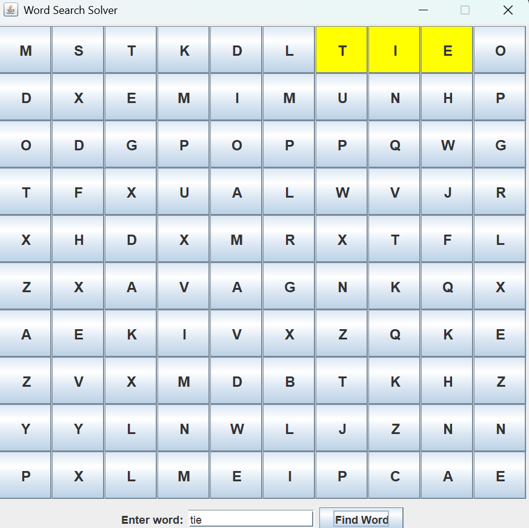

# 🧩 Word Search Solver

A **Java Swing GUI application** that generates a random 10x10 letter grid and allows the user to search for a word within it.

---

## 🚀 Features

- ✅ Random 10x10 word search grid using uppercase English letters
- ✅ Text input for user to search any word
- ✅ Highlights the found word path in yellow
- ✅ Uses **backtracking with pruning** for directional search
- ✅ The algorithm:
        - Checks each cell for the first letter.
        - Tries each of 8 directions from that point.
        - Proceeds if characters match, backtracks otherwise.
---

## 🖼️ Demo

 
---

## 🔧 Tech Stack

- **Java**
- **Swing GUI**

## 🧠 Algorithm Details

- **Backtracking**: Recursively follows the character path.
- **Pruning**: Stops early if out of bounds or mismatch occurs.
- Time Complexity: O(N² * 8 * L),  
  where N = grid size, L = word length.

## 💭 Reflections 

- This project helped me further strengthen my algorithmic thinking process and problem solving skills. 
- Learned about Swing in Java. 


## 🏁 How to Run

1. Make sure you have **Java 8+** installed.
2. Compile:
   ```bash
   javac WordSearchSolver.java
   java WordSearchSolver 


